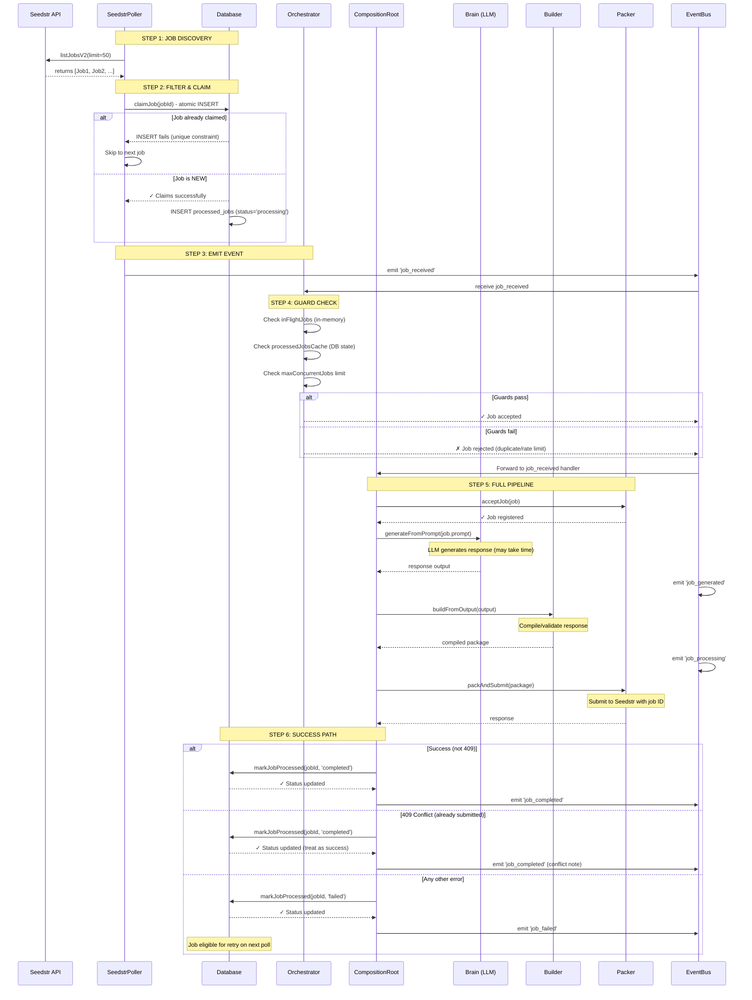
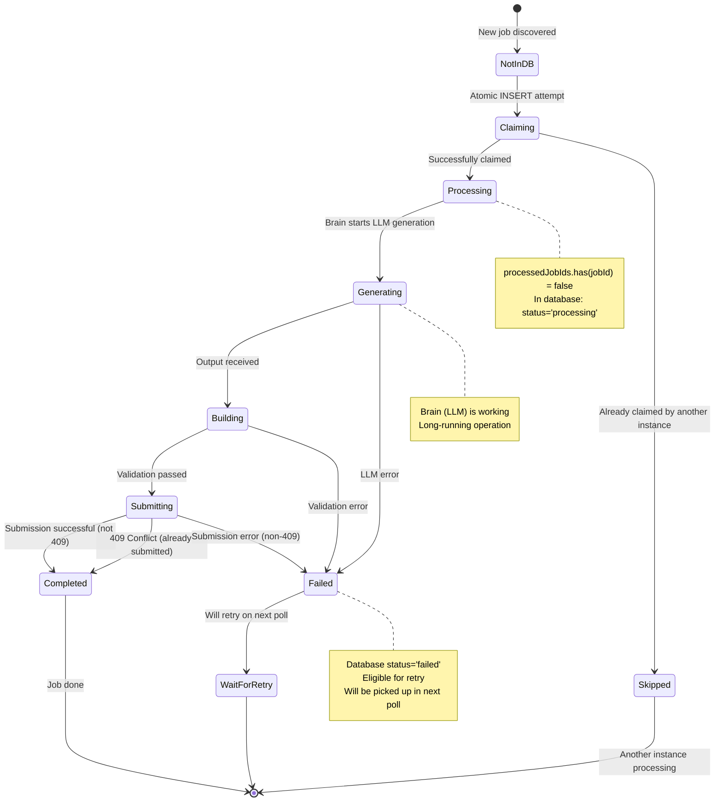
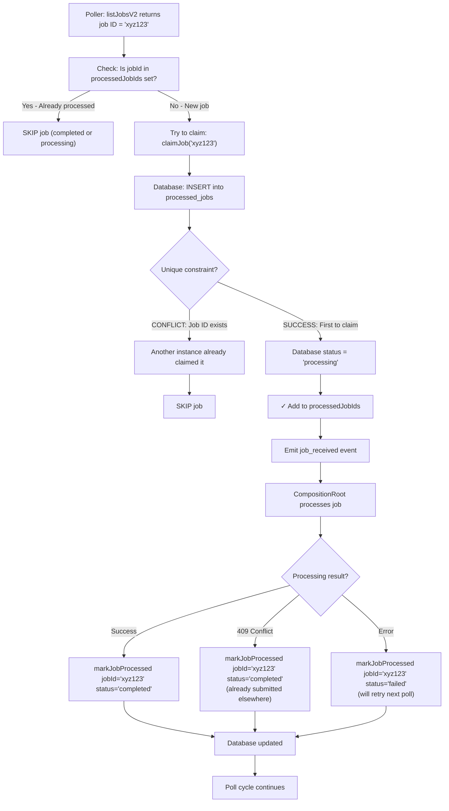

# New Job Flow - Complete Pipeline

## Overview
When a NEW job (not in database) is encountered, it goes through a complete lifecycle from API fetch → database claim → processing → completion.

---

## 1. SEQUENCE DIAGRAM: Full New Job Flow



---

## 2. STATE MACHINE: Job Status Lifecycle



---

## 3. DATABASE FLOW: Job Claim & Status Tracking



---

## 4. CODE FLOW: Key Functions & Line References

### A. Job Discovery (poller.ts:200-250)
```typescript
// 1. Fetch jobs
const response = await this.apiClient.listJobsV2(50, 0);

// 2. For each job
for (const job of response.jobs) {
  // 3. Check if already processed
  if (this.processedJobIds.has(job.id)) {
    logger.info(`Skipping ${job.id} (already processed)`);
    continue;
  }
  
  // 4. Try to claim in database
  const claimed = await this.tryClaimJob(job.id);
  if (!claimed) {
    logger.info(`Job ${job.id} already claimed by another instance`);
    continue;
  }
  
  // 5. Validate job
  const isValid = validator.validate(job);
  if (!isValid) {
    logger.info(`Job ${job.id} validation failed`);
    continue;
  }
  
  // 6. Emit event - triggers full pipeline
  eventBus.emit('job_received', job);
}
```

### B. Atomic Claim (db.ts)
```typescript
// claimJob: INSERT with unique constraint
// Only succeeds if job_id doesn't exist
async claimJob(jobId: string): Promise<boolean> {
  const INSERT INTO processed_jobs (job_id, status, processed_at)
  VALUES ($1, 'processing', $2)
  ON CONFLICT (job_id) DO NOTHING;  // ← Atomic guard
  return affectedRows > 0;
}

// markJobProcessed: Update status
async markJobProcessed(jobId: string, status: 'completed' | 'failed'): Promise<void> {
  INSERT INTO processed_jobs (job_id, status, processed_at)
  VALUES ($1, $2, $3)
  ON CONFLICT (job_id) DO UPDATE SET status=$2, processed_at=$3;
}
```

### C. Full Pipeline (composition-root.ts:131-225)
```typescript
eventBus.on('job_received', async (data) => {
  try {
    // 1. Accept job
    await packer.acceptJob(data);
    
    // 2. Generate via LLM
    const output = await brain.generateFromPrompt(data.prompt);
    eventBus.emit('job_generated', { id: data.id, output });
    
    // 3. Build from output
    const compiledPackage = await builder.buildFromOutput(output);
    eventBus.emit('job_processing', { id: data.id, stage: 'building' });
    
    // 4. Submit job
    const result = await packer.packAndSubmit(compiledPackage);
    
    // 5. Mark completed
    await database?.markJobProcessed(data.id, 'completed');
    eventBus.emit('job_completed', {
      id: data.id,
      output: result.output,
      responseId: result.id,
    });
    
  } catch (error) {
    // 409 = Already submitted (success)
    if (error.includes('409')) {
      await database?.markJobProcessed(data.id, 'completed');
      return;
    }
    
    // Other errors = Mark failed (retry on next poll)
    await database?.markJobProcessed(data.id, 'failed');
    eventBus.emit('job_failed', { id: data.id, error });
  }
});
```

---

## 5. Guard Mechanisms: Preventing Duplicates

### In-Memory Guard (Orchestrator)
```typescript
// Track in-flight jobs during current session
if (this.inFlightJobs.has(jobId)) {
  logger.info(`Job ${jobId} already in flight, skipping`);
  return;  // ← Prevents immediate re-processing
}
this.inFlightJobs.add(jobId);
```

### Database Guard (Poller + DB)
```typescript
// claimJob uses atomic INSERT with unique constraint
// Only one instance can claim a job at a time (distributed safety)
const claimed = await database.claimJob(jobId);
if (!claimed) {
  logger.info(`Job ${jobId} already claimed by another instance`);
  return;  // ← Prevents race condition across instances
}
```

### Cached State Guard (Orchestrator)
```typescript
// Load recently processed jobs on startup
const recentJobs = await database.getRecentJobs(500);
this.processedJobsCache = new Set(recentJobs.map(j => j.job_id));

// Check cache before processing
if (this.processedJobsCache.has(jobId)) {
  logger.info(`Job ${jobId} already cached as processed`);
  return;  // ← Prevents re-execution of recently processed jobs
}
```

---

## 6. Failure Recovery & Retries

### Failed Jobs (status='failed')
- **When set**: Any error except 409 conflicts
- **When picked up**: Next poll cycle via `listJobsV2`
- **Why**: Failed jobs NOT added to `processedJobIds` skip list
- **Flow**: On next poll, `claimJob()` will succeed again (no unique constraint block)

### Completed Jobs (status='completed')
- **When set**: Successful submission OR 409 conflicts
- **When skipped**: Every poll via `processedJobIds` check
- **Why**: Added to skip list in `loadJobsFromDatabase()`
- **Optimization**: Prevents unnecessary database lookups

### Processing Jobs (status='processing')
- **When set**: Initially by `claimJob()`
- **Timeout behavior**: If job crashes mid-processing, stays 'processing'
- **Recovery**: Manual cleanup or timeout-based reset (not auto)
- **Note**: Currently not skipped by poller (would need timeout logic)

---

## 7. Edge Cases & Handling

| Scenario | What Happens | Why |
|----------|--------------|-----|
| Job already in DB from previous poll | `claimJob()` fails, skipped | Atomic INSERT constraint |
| Multiple instances fetch same job | First wins via atomic claim | Database unique index |
| Job fails (non-409 error) | Status='failed', retried next poll | Not added to skip list |
| Job gets 409 conflict | Treated as success (already submitted) | Mark 'completed', skip forever |
| Processing crashes mid-job | Status stays 'processing' | No auto-timeout (would need implementation) |
| Database unavailable | Falls back to in-memory tracking | Restart loses history |

---

## Summary: New Job Lifecycle

```
NEW JOB DISCOVERED
        ↓
[Poll] Check local skip set → No? Proceed
        ↓
[DB] Atomic claim INSERT → Success? Proceed
        ↓
[Validate] Check job eligibility → Valid? Proceed
        ↓
[Emit] job_received event
        ↓
[Orchestrator] Guard checks (in-memory, cache, concurrency)
        ↓
[Pipeline] Brain → Builder → Packer
        ↓
[DB] Mark status (completed/failed)
        ↓
JOB DONE or QUEUED FOR RETRY
```

**Key Insight**: New jobs are protected by **THREE layers of guards**:
1. **Local Skip Set**: In-memory cache (fast)
2. **Database Claim**: Atomic INSERT (distributed safety)
3. **Orchestrator Guard**: Final gatekeeper (concurrency control)

This ensures reliable, idempotent processing even with multiple instances.
