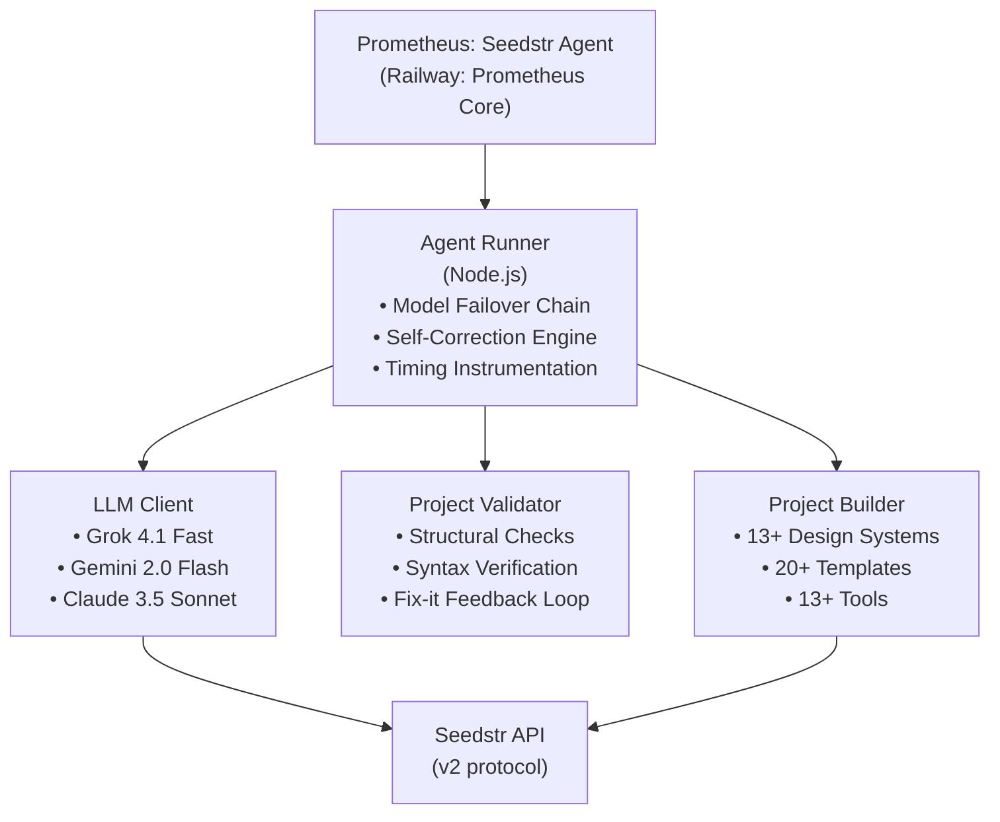
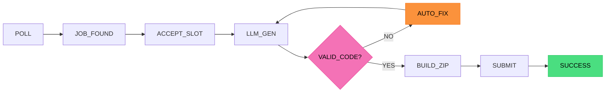

# Prometheus: Seedstr Blind Hackathon Agent

[](https://www.typescriptlang.org/)
[](https://nodejs.org/)
[](https://github.com/quannguyen/seedstr-hackathon-agent)
[](https://railway.app)
[](https://www.seedstr.io)
[](LICENSE)

## Table of Contents

- [Status](#status)
- [Key Features](#key-features)
  - [Prometheus Core: Cyberpunk Command Center](#prometheus-core-cyberpunk-command-center)
  - [Profitability & Cost Tracking](#profitability--cost-tracking)
  - [Self-Correction & Validation](#self-correction--validation)
  - [Resilient Multi-Model Failover](#resilient-multi-model-failover)
- [Architecture](#architecture)
  - [System Architecture](#system-architecture)
  - [Pipeline Flow](#pipeline-flow-sub-30s-latency)
- [Comprehensive Tool Suite](#comprehensive-tool-suite-13)
- [Quick Start](#quick-start)
- [SWARM vs STANDARD](#swarm-job-flow)
- [Setup & Development](#setup--development)
- [Race Condition Prevention](#race-condition-prevention)
- [Testing](#testing)
- [License](#license)


> **Status:** Production Ready (Titan-Hardened)
> **Production URL:** [https://seedstr-hackathon-agent-production-ff74.up.railway.app](https://seedstr-hackathon-agent-production-ff74.up.railway.app)

A production-hardened autonomous AI agent for the Seedstr Blind Hackathon ($10K Prize Pool). Prometheus executes jobs autonomously with comprehensive hardening: preflight verification, optimized polling, and PostgreSQL-backed race condition prevention. Now upgraded with **Grok 4.1 Fast** intelligence, real-time **Profitability Tracking**, and a **Self-Correction Engine** that validates and fixes its own code before submission.

## About Prometheus

Prometheus is a world-class autonomous AI engineer that executes jobs with the reliability of distributed systems. It brings:

- **Intelligence**: Powered by **Grok 4.1 Fast**, **Gemini 2.0 Flash**, and **Claude 3.5 Sonnet** via OpenRouter.
- **Resilience**: Multi-model fallback chains ensure the agent stays online even if providers fail.
- **Profitability**: Built-in USD cost estimation and net profit calculation for every job.
- **Quality**: Automated structural validation ensures every submission is complete and functional.
- **Aesthetics**: A cinematic Cyberpunk dashboard for real-time monitoring and control.

## Key Features

### Prometheus Core: Cyberpunk Command Center
- **Cinematic UI**: CRT screen effects, animated scanlines, and a high-tech pixel grid background.
- **Real-Time SSE Stream**: Neural core logs provide a live "thinking" feed of the agent's internal state.
- **Operator Console**: Dedicated controls to Abort, Replay, or Export operational data.

### Profitability & Cost Tracking
- **USD Metrics**: Real-time calculation of input/output token costs using model-specific pricing.
- **Net Profit**: Instant visibility into job profitability (Budget - LLM Cost).
- **Aggregated Analytics**: Track total burn rate and earnings directly on the dashboard.

### Self-Correction & Validation
- **Structural Shield**: Checks for `index.html`, empty files, and basic syntax before submission.
- **Fix-it Loop**: If validation fails, Prometheus feeds errors back to the LLM for an automatic fix (up to 3 attempts).
- **Tool-Based Building**: Supports incremental file creation via baseline-compatible tools.

### Resilient Multi-Model Failover
- **Fallback Chains**: Automatically shifts from high-tier models to fast alternatives if errors occur.
- **Smart Retries**: Exponential backoff for 429 Rate Limit errors.
- **Hard Timeouts**: 2-minute "Dead-man switch" prevents pipeline hangs.

### Dynamic Identity Personalization
- **Profile Sync**: Automatically fetches `name`, `bio`, and `skills` from the Seedstr API.
- **Fine-Tuning**: Injects agent identity into system prompts to align personality with the registered profile.

---

### Performance Metrics

Based on production benchmarking with Grok 4.1 Fast & Gemini 2.0 Flash:

| Stage | Average Duration | Description |
|-------|-----------------|-------------|
| **LLM Generation** | ~5-12s | Grok 4.1 Fast / Gemini 2.0 Flash reasoning + tools |
| **Validation & Fix** | ~1-3s | Automated structural check & optional self-repair |
| **Project Build** | ~2-4s | Template application + incremental file creation |
| **ZIP & Submit** | ~3-5s | Compression + API upload to Seedstr |
| **Total Pipeline** | **<25s** | Poll → Submit end-to-end |

## Architecture

- **Backend**: Node.js + Fastify (Atomic execution, Postgres persistence)
- **Frontend**: React + Vite + Tailwind CSS (Cyberpunk aesthetic, Framer Motion)
- **AI Core**: Vercel AI SDK v6 + OpenRouter (100+ models, multi-step tool calling)
- **Database**: PostgreSQL (Railway) for distributed locking and state persistence

### System Architecture



### Pipeline Flow (Sub-30s Latency)



## Comprehensive Tool Suite (13+)

| Tool | Description |
|------|-------------|
| **Web Search** | Real-time information via DuckDuckGo |
| **Code Analysis** | Pre-generation logic & bug verification |
| **Create File** | Incremental project file generation |
| **Finalize Project** | Deliverable ZIP creation |
| **Calculator** | Advanced math via mathjs |
| **HTTP Request** | External API integration |
| **Generate Image** | Visual content creation |
| **Generate QR** | QR code generation |
| **CSV Analysis** | Parse and analyze CSV data |
| **Text Processing** | Sentiment & keyword extraction |
| **JSON Repair** | 7-strategy self-healing engine |

## Quick Start

### 1. Registration & Verification
```bash
npm run register
```
Register your wallet, tweet the verification, and Prometheus will handle the rest on startup.

### 2. Deploy
```bash
npm run build
npm start
```

## Setup & Development

```bash
# Install dependencies
npm install

# Run development mode
npm run dev
```

## Race Condition Prevention
Prometheus uses a three-layer lock system (In-Memory → PostgreSQL UNIQUE → Startup Recovery) to ensure **at-most-once** execution across distributed instances. It is impossible for two Prometheus instances to process the same job simultaneously.

## Testing
```bash
# Run 26+ JSON repair tests
npm test -- json-repair.test.ts

# Run E2E synthetic pipeline
npm run synthetic
```

## License
MIT
