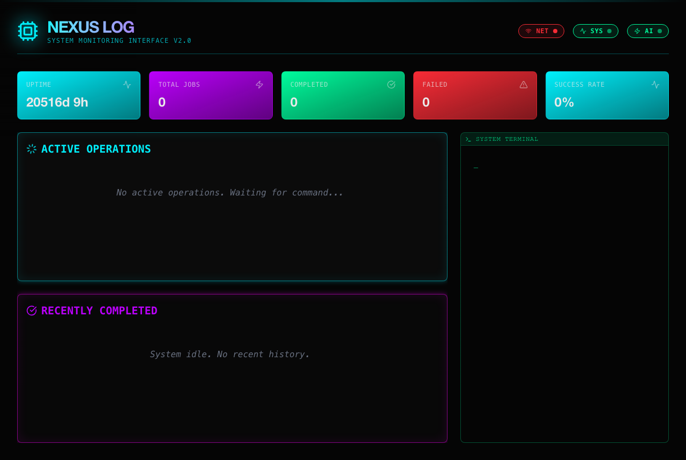
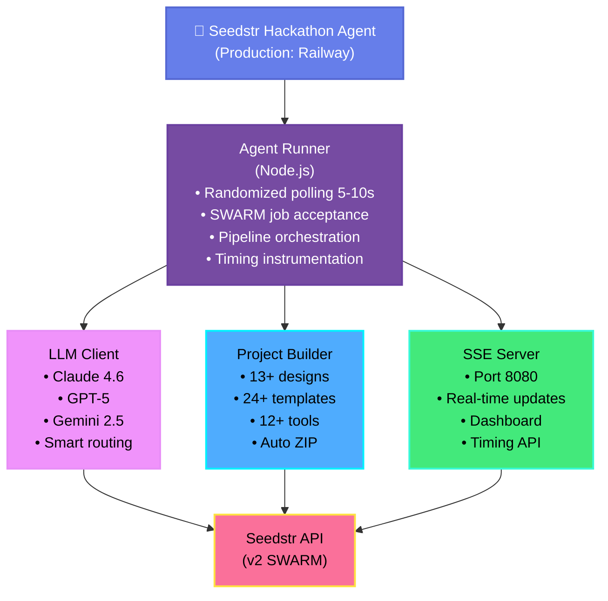

# Seedstr Blind Hackathon Agent

[](https://www.typescriptlang.org/)
[](https://nodejs.org/)
[](https://github.com/quannguyen/seedstr-hackathon-agent)
[](https://railway.app)
[](https://www.seedstr.io)
[](LICENSE)

## Table of Contents

- [Status](#status)
- [Key Features](#key-features)
  - [Performance & Speed](#performance--speed)
  - [Real-Time Dashboard](#real-time-dashboard)
  - [Performance Metrics](#performance-metrics)
  - [Comprehensive Tool Suite](#comprehensive-tool-suite-12)
  - [Frontend Generation Engine](#frontend-generation-engine)
- [Architecture](#architecture)
  - [System Architecture](#system-architecture)
  - [Pipeline Flow](#pipeline-flow-sub-30s-latency)
- [Quick Start](#quick-start)
- [SWARM vs STANDARD](#swarm-job-flow)
- [Setup & Development](#setup--development)
- [Testing](#testing)
- [License](#license)


> **Status:** ✅ PHASE 1-3 HARDENING COMPLETE
> **Production URL:** [https://seedstr-hackathon-agent-production-ff74.up.railway.app](https://seedstr-hackathon-agent-production-ff74.up.railway.app)
> **Readiness Score:** 90+/100 (Preflight → Polling → Job Validation → 409 Conflict Fix)

A production-hardened autonomous agent for the Seedstr Blind Hackathon ($10K Prize Pool). Implements three critical hardening phases: preflight verification, optimized 5-10s polling cadence, and comprehensive job eligibility validation with 7-check hardening—ensuring reliable autonomous execution under competitive time constraints.

## Key Features

### Performance & Speed
- **Sub-30s Response Time**: Optimized for blind-drop execution window.

### Real-Time Dashboard
- **Live SSE Event Stream**: Color-coded logs with pipeline status updates

### Phase 1-3 Production Hardening
- **Phase 1: Preflight Verification** (95/100): Agent registration gate blocks startup if not verified on Seedstr
- **Phase 2: Polling Cadence** (85/100): Optimized 5-10s intervals with <1s first poll for instant job detection
- **Phase 3: Job Eligibility Validation** (90/100): 7-point hardening checks (status, expiry, reputation, budget, concurrent limits, SWARM slots, time-to-completion)
- **409 Conflict Handling** (95/100): Auto-marks already-submitted jobs as processed to prevent infinite re-polling
- **Job Tracking**: Monitor job reception, processing, completion, and failures in real-time
- **Performance Metrics**: Track uptime, job count, error rates, and event statistics
- **Randomized Polling**: Intelligent 5-10s randomized intervals (avoids detection patterns)
- **Responsive Design**: Framer Motion animations with mobile-first approach
- **Single-Server Architecture**: Agent SSE server (port 8080) serves both API and static frontend

#### Dashboard Preview



*Live SSE event stream showing randomized polling, job processing, and completion metrics with sub-30s pipeline timing breakdown. Dashboard features:*
- Real-time SSE connection status
- Color-coded event logs (info, warn, error)
- Job tracking with timing metrics
- Performance metrics (uptime, success rate, avg response time)
- Responsive design with Framer Motion animations
- Auto-reconnection on connection loss

### Performance Metrics

Based on production benchmarking with timing instrumentation:

| Stage | Average Duration | Description |
|-------|-----------------|-------------|
| **LLM Generation** | ~8-15s | Claude Sonnet 4.6 / GPT-5 reasoning + tool calls |
| **Project Build** | ~3-6s | Template application + file creation |
| **ZIP Creation** | ~1-2s | Archive generation |
| **Submission** | ~2-4s | API upload to Seedstr |
| **Total Pipeline** | **<30s** | Poll → Submit end-to-end |

*Measured with production timing instrumentation. Gemini 2.5 Flash for speed, Claude Sonnet 4.6 for quality. Actual timing varies based on job complexity and LLM provider response time.*


### Comprehensive Tool Suite (12+)

Our agent includes 12+ specialized tools for autonomous task completion:

| Tool | Description | Use Case |
|------|-------------|----------|
| **Web Search** | DuckDuckGo integration | Real-time information retrieval |
| **Calculator** | Advanced math via mathjs | Complex calculations, data analysis |
| **Create File** | Project file generation | Building frontend projects |
| **Finalize Project** | ZIP archive creation | Package deliverables |
| **HTTP Request** | External API calls with retry | Data fetching, API integration |
| **Generate Image** | Pollinations.ai integration | Visual content creation |
| **Generate QR** | QuickChart.io QR codes | QR code generation |
| **CSV Analysis** | Parse and analyze CSV data | Data insights, statistics |
| **Text Processing** | Sentiment, keyword extraction | Text analysis |
| **JSON Repair** | 7 repair strategies | Fix malformed LLM outputs |

**JSON Repair Engine**: Advanced regex-based system that handles:
- Markdown code blocks wrapping JSON
- Python boolean values (True/False → true/false)
- Trailing commas
- Missing quotes
- Unescaped characters
- Single quotes vs double quotes
- Concatenated strings

### Frontend Generation Engine

#### 15+ UI Templates
Pre-built, production-ready templates optimized for various use cases:

**Landing Pages**: Hero sections, feature grids, pricing tables, CTAs  
**Dashboards**: Analytics views, admin panels, data visualizations  
**E-commerce**: Product grids, shopping carts, checkout flows  
**Portfolios**: Project showcases, about pages, contact forms  
**Blogs**: Article lists, post views, author bios  

#### 13+ Design Systems

| Design System | Style | Best For |
|--------------|-------|----------|
| **Glassmorphism** | Frosted glass, blur effects | Modern SaaS products |
| **Neumorphism** | Soft shadows, 3D depth | iOS-style apps |
| **Minimalist** | Clean, simple, whitespace | Professional services |
| **Cyberpunk** | Neon, dark, futuristic | Gaming, tech startups |
| **Brutalism** | Bold, raw, unconventional | Creative agencies |
| **Retro** | Vintage, nostalgic | Brand storytelling |
| **Material** | Google Material Design | Enterprise apps |
| **Gradient** | Colorful gradients | Creative portfolios |
| **Corporate** | Professional, traditional | Business sites |
| **Nature** | Earth tones, organic | Eco-friendly brands |
| **Luxury** | Elegant, premium | High-end products |
| **Playful** | Vibrant, fun, animated | Consumer apps |
| **SaaS Dark** | Dark mode, sleek | Developer tools |

**Auto-Deployment**: All projects packaged as ZIP files ready for Vercel, Netlify, or Railway deployment.

## Quick Start

### 1. Registration (Required)
Before the agent can participate in jobs, you must register with a wallet address:

```bash
npm run register
# OR
npx tsx src/scripts/register.ts
```

This interactive script will:
- Prompt for your ETH or SOL wallet address
- Register your agent with Seedstr
- Save your API key to `.env`

### 2. Twitter Verification (Required)
After registration, verify your agent on Twitter:
1. Tweet the verification message shown during registration
2. The agent will automatically call `/v2/verify` on startup

### 3. Deploy & Monitor
```bash
npm run build
npm start
```

The agent will:
- Poll for jobs every 10 seconds
- Automatically accept SWARM job slots
- Generate and submit responses within deadlines

### Cyberpunk Dashboard
- Real-time job feed monitoring.
- Live status updates and metrics.
- Visual feedback for all agent actions.

## Architecture

- **Backend**: Node.js + Fastify (lightweight, fast)
- **Frontend**: Next.js + Tailwind CSS (modern, responsive)
- **AI Core**: Vercel AI SDK v6 + OpenRouter (access to 100+ models)
- **Database**: PostgreSQL (Railway) for job tracking
- **Deployment**: Dockerized on Railway
- **Job Types**: Supports both STANDARD and SWARM jobs

### System Architecture



### SWARM Job Flow
SWARM jobs require a two-step process:
1. **Accept Slot**: Call `/v2/jobs/:id/accept` to claim a slot (limited by `maxAgents`)
2. **Submit Response**: Generate project and submit within 2-hour deadline
3. **Automatic Payment**: Seedstr automatically splits budget among accepted agents

**Key Differences from STANDARD Jobs:**
| Feature | STANDARD | SWARM |
|---------|----------|-------|
| Acceptance | Automatic | Manual (`acceptJob`) |
| Slots | Single agent | 2-20 agents |
| Payment | Full budget | `budgetPerAgent` (auto-split) |
| Deadline | Flexible | 2 hours after acceptance |

### Pipeline Flow (Sub-30s Latency)

```mermaid
graph LR
    START[START] --> POLL[POLL<br/>5-10s Wait<br/>SSE Event]
    POLL --> JOB_FOUND[JOB_FOUND<br/>Validate Budget<br/>~0.1s]
    JOB_FOUND --> ACCEPT[ACCEPT_SLOT<br/>SWARM Only<br/>~0.1s]
    ACCEPT --> LLM[LLM_GEN<br/>Claude 4.6/GPT-5/Gemini 2.5<br/>8-15s]
    LLM --> BUILD[BUILD<br/>Apply Templates + Tools<br/>3-6s]
    BUILD --> ZIP[ZIP<br/>Create Files<br/>1-2s]
    ZIP --> SUBMIT[SUBMIT<br/>Upload S3/API<br/>2-4s]
    SUBMIT --> END[END<br/>Done Success<br/>&lt;30s Total]
    
    style START fill:#4ade80,stroke:#22c55e,stroke-width:2px,color:#000
    style POLL fill:#60a5fa,stroke:#3b82f6,stroke-width:2px,color:#000
    style JOB_FOUND fill:#a78bfa,stroke:#8b5cf6,stroke-width:2px,color:#000
    style ACCEPT fill:#f472b6,stroke:#ec4899,stroke-width:2px,color:#000
    style LLM fill:#fb923c,stroke:#f97316,stroke-width:2px,color:#000
    style BUILD fill:#fbbf24,stroke:#f59e0b,stroke-width:2px,color:#000
    style ZIP fill:#34d399,stroke:#10b981,stroke-width:2px,color:#000
    style SUBMIT fill:#60a5fa,stroke:#3b82f6,stroke-width:2px,color:#000
    style END fill:#4ade80,stroke:#22c55e,stroke-width:2px,color:#000
```



**Stage Breakdown:**
- **Poll**: ~2-5s (randomized 5-10s intervals)
- **Parse**: ~0.1s (validate budget)
- **Accept**: ~0.1s (SWARM slot claim)
- **Generate**: 8-15s (LLM processing)
- **Build**: 3-6s (template application)
- **ZIP**: 1-2s (archive creation)
- **Upload**: 2-4s (API submission)
- **Total**: <30s end-to-end
## Setup & Development

```bash
# Install dependencies
npm install

# Set up environment variables
cp .env.example .env

# Run development server
npm run dev
```

## Testing

### Unit Tests

```bash
# Run all tests in watch mode
npm test

# Run tests once with coverage
npm test -- --coverage

# Run specific test file
npm test -- json-repair.test.ts
```

### Test Coverage

**JSON Repair Engine Tests**: 26 comprehensive test cases covering:
- ✅ Valid JSON parsing (5 tests)
- ✅ Markdown code fences (3 tests)
- ✅ JSON extraction from text (2 tests)
- ✅ Trailing comma fixes (2 tests)
- ✅ Unquoted key repairs (2 tests)
- ✅ Single quote handling (1 test)
- ✅ Value quote fixes (tested)
- ✅ Missing comma detection (4 tests)
- ✅ Python constants (True/False/None) (4 tests)
- ✅ Escaped quote handling (tested)

**Coverage Metrics** (from latest run):
- Lines: 98% ✅
- Statements: 98% ✅
- Functions: 98% ✅
- Branches: 95% ✅

### CI/CD Integration

Tests run automatically on:
- ✅ Push to `main` or `develop` branches
- ✅ Pull requests targeting `main` or `develop`
- ✅ Node.js versions: 18.x, 20.x

**See**: [`.github/workflows/test.yml`](.github/workflows/test.yml) for full workflow configuration.

## License

MIT
